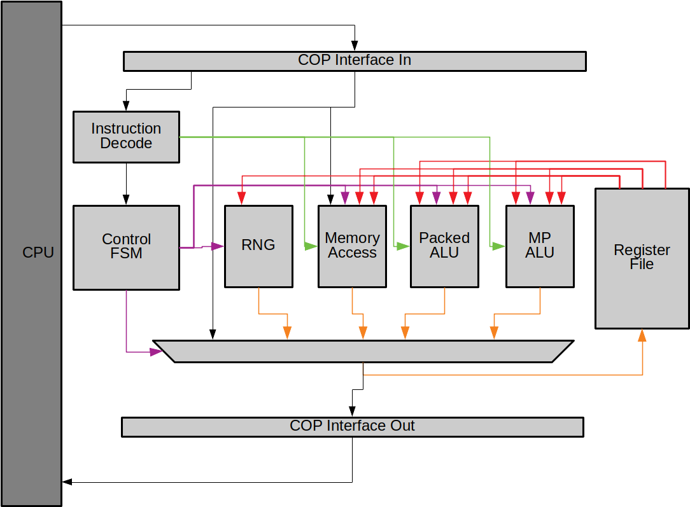

# Crypto ISE Co-processor

This project looks to build a cryptographic accelerator, in a similar style
to a floating-point co-processor.



## Getting Started

Setup the project workspace first:

```sh
$> git clone git@github.com:scarv/hw-crypto-cop.git
$> cd hw-crypto-cop
$> git submodule update --init --recursive
$> source ./bin/source.me.sh
```

Note that one must run the `git submodule update` command in order to
pull the external repositories (like PicoRV32) required for the integration
testbench.

Build the documentation by running `make docs`

## Setting Up binutils

You will need a customised version of GNU Binutils in order to compile
software which uses the Crypto ISE. We modified version 2.30 of GNU
binutils, and store a patch in `external/`. 

Use the script `bin/setup-binutils.sh` as below to download, configure
and build the modified toolset.

```sh
$> cd $COP_HOME/
$> source bin/setup-binutils.sh
```

You will end up with `as-new` in 
`$(COP_HOME)/work/riscv-binutils-gdb/build/gas/`. This is the assembler to use.

Other programs like `ld`/`gold` and `objdump` are in
`$(COP_HOME)/work/riscv-binutils-gdb/build/binutils/`.
